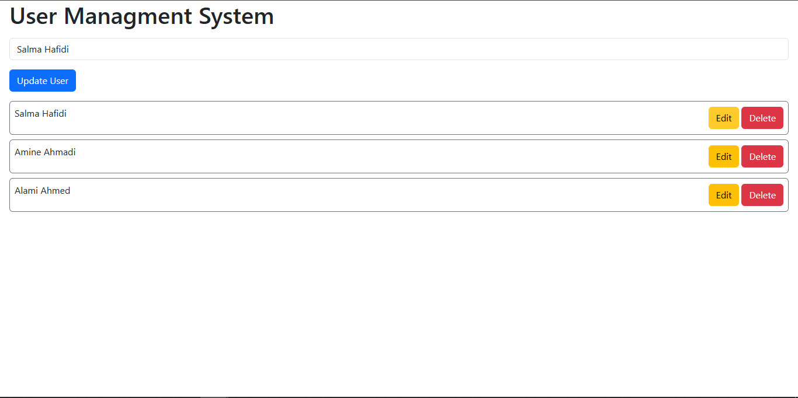

# Simple User Managment System - With React Vite and ReduxToolKit

## Table of contents

- [Overview](#overview)
  - [Screenshot](#screenshot)
  - [Links](#links)
- [My process](#my-process)
  - [Built with](#built-with)
- [Author](#author)

## Overview

Users should be able to:

- View the optimal layout for the component depending on their device's screen size
- See the social media share links when they click the share icon

### Screenshot

-Add User-

-Edit User-

-Delete User-

### Links

- Live Site URL: ()

## My process

### Built with

- Semantic HTML5 markup
- Bootstrap 5
- React JS
- Redux Tool Kit

## Author

- LinkedIn - [@Aboubakr](https://www.linkedin.com/in/aboubakr-elbouzidi-b16581251/)

 
